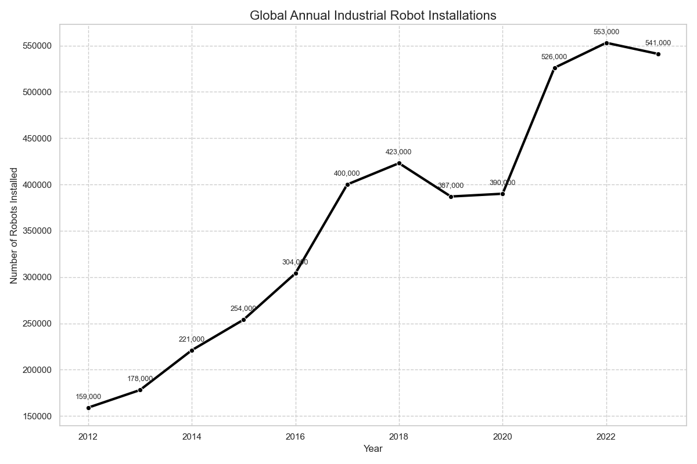
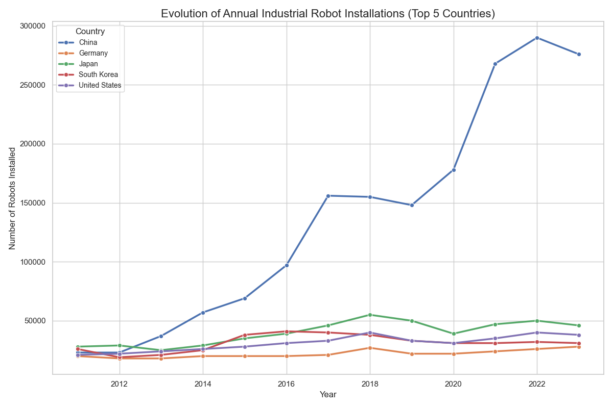
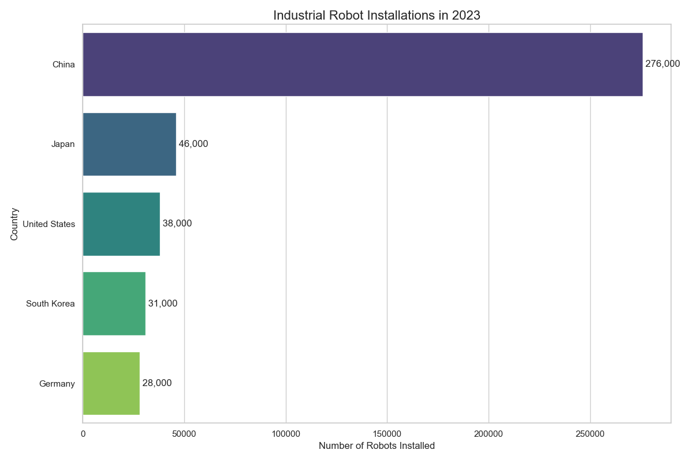

# Analyse des Installations de Robots Industriels (2011-2023)

Cette analyse se base sur les données de l'International Federation of Robotics (IFR) pour les 5 principaux pays utilisateurs de robots industriels : Chine, Allemagne, Japon, Corée du Sud et États-Unis.

## 1. Évolution Mondiale

L'installation de robots industriels dans le monde a connu une croissance soutenue au cours de la dernière décennie.

*   **Tendance** : On observe une tendance clairement haussière, passant d'environ 159 000 unités en 2012 à plus de 540 000 en 2023.
*   **Pic** : Un pic a été atteint en 2022 avec 553 000 installations.

## 2. Comparaison par Pays (Top 5)

L'analyse détaillée par pays révèle une disparité frappante, dominée par l'ascension fulgurante de la Chine.

*   **La Chine (Ligne bleue)** : La courbe de la Chine est exponentielle. Elle est passée de niveaux comparables aux autres pays en 2011 (~23k) à une position ultra-dominante en 2023 (>270k).
*   **Les autres pays** : Le Japon, la Corée du Sud, les États-Unis et l'Allemagne montrent une croissance beaucoup plus modérée, voire une stagnation relative par rapport à la Chine.

## 3. Parts de Marché Cumulées

Ce graphique en aires empilées permet de visualiser le volume total des installations de ces 5 pays et la part de chacun.

*   La zone bleue (Chine) s'élargit considérablement année après année, écrasant visuellement les parts des autres nations. Cela confirme que le moteur de la croissance mondiale de la robotique industrielle est principalement situé en Chine.

## 4. Situation en 2023

Le graphique ci-dessous montre les installations pour la dernière année disponible (2023).

*   **Domination écrasante** : Avec 276 000 robots installés, la Chine installe plus de **5 fois plus** de robots que le deuxième pays du classement, le Japon (46 000).
*   **Le reste du peloton** : Les États-Unis (38k), la Corée du Sud (31k) et l'Allemagne (28k) suivent avec des volumes comparables entre eux, mais très loin du leader.

## Conclusion

L'analyse des données montre sans équivoque que la **Chine** est devenue l'usine automatisée du monde. Alors que les autres puissances industrielles (Japon, Allemagne, USA, Corée) continuent d'investir dans la robotisation à un rythme régulier, la Chine a opéré un changement d'échelle massif, représentant désormais la majorité des nouvelles installations parmi les leaders mondiaux.
